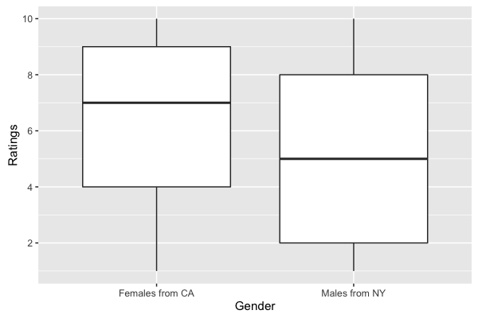

```{r setup, include=FALSE}
knitr::opts_chunk$set(tidy.opts=list(width.cutoff=60), tidy=TRUE, warning=FALSE, message = FALSE, fig.path='Plots/', echo = TRUE)
```

## Question 1: Law of Large Numbers and Central Limit Theorem

**1a)**
As the sample size n increases, the difference between the sample mean and the population mean approaches 0, showing that $\bar{X}_{n}^{(1)}$ is an unbiased estimator of the population mean.

**1b)**
The law of large numbers states that the sample mean will approach the true expectation as sample size n $\rightarrow \infty$. This is what we observe for the sample mean $\bar{X}_{n}^{(1)}$ and the true expectation $\mu$ = EX = 0. We see that as n increases, the graphs approach zero because $|\bar{X}_{i}^{(1)} - \mu|$ becomes smaller (and thus the indicator function outputs 0 more frequently). For larger $\epsilon$, it becomes less likely that $|\bar{X}_{i}^{(1)} - \mu|$ > $\epsilon$, so the graph for $\epsilon$ = 0.5 is consistently the lowest.

**1c)**
$\mu$ = EX = 0, variance $\sigma^{2}$ = var X = 1. The Central Limit Theorem predicts that the distribution of the sample means of i.i.d random variables approaches the standard normal distribution as n $\rightarrow \infty$. Here, histograms of the quantity $\sqrt{n}\frac{(\bar{X}_{n}^{(i)} - \mu)}{\sigma}$ form increasingly normal-shaped curves centered around the expectation $\mu$ = 0. Similarly, the qq-plots become increasingly linear on the line y = x as n increases, which indicates that the distribution of the above quantity is becoming increasingly normal.

**1d)**
In Part c, we saw that $\sqrt{n}\frac{(\bar{X}_{n}^{(i)} - \mu)}{\sigma}$ converged in distribution to the standard normal distribution. This plot shows $\sqrt{n}\frac{(\bar{X}_{n}^{(i)} - \mu)}{\sigma}$ **does not converge** in probability to the standard normal random variable $Y_{i}$, because $\sqrt{n}\frac{(\bar{X}_{n}^{(i)} - \mu)}{\sigma}$ does not take on same or very close values as $Y_{i}$ which we would expect (yielding a difference of 0). When one random variable converges in distribution to another random variable, it will take on similar values over time, but any given pair of observations may not match because random variables are not fixed quantities like expectations. This is also why this graph has no trend as n grows larger.

```{r Q1}
library(ggplot2)
# Expectation of X is 0
mu <- 0
# Variance of X is 1
sigma_squared <- 1
Xn <- matrix(rep(0, 4*10000), ncol = 4, nrow = 10000)
n <- c(10, 100, 1000, 10000)

# outer for-loop is for values of n
for (i in 1:dim(Xn)[2]) {
  Xn[, i] <- sapply(1:dim(Xn)[1], function(x) {
    mean(round(runif(n[i], 0, 1)) * 2 - 1)
  })
}

# 1a)
df <- data.frame(n, Xn[1,])
names(df) <- c("n", "Xn")
ggplot(df, aes(x = n, y = Xn)) + geom_point() + geom_line() + scale_x_log10(name="log10(n)") + scale_y_continuous(name="Deviation")

# 1b)
epsilon <- c(0.5, 0.1, 0.05)
df <- data.frame(rep(n, 3), rep(0, 3*length(n)), c(rep("eps = 0.5", 4), rep("eps = 0.1", 4), rep("eps = 0.05", 4)))
for (i in 1:length(epsilon)) {
  for (j in 1:dim(Xn)[2]) {
    values <- rep(0, dim(Xn)[1])
    for (k in 1:dim(Xn)[1]) {
      if (abs(Xn[k, j] - mu) > epsilon[i]) {
        values[k] <- 1
      }
    }
    df[4*(i-1) + j,2] <- sum(values) / length(values)
  }
}
names(df) <- c("n", "fn", "eps")

ggplot(df, aes(x = n, y = fn, color = eps, linetype = eps, shape = eps)) + geom_point() + geom_line() + scale_x_log10(name="log10(n)") + scale_y_continuous(name="f(n)")

# 1c)
# Histogram and QQ plot for n = 10
df <- data.frame(sapply(Xn[, 1], function(x) {
  return(sqrt(10)*(x - mu) / sqrt(sigma_squared))
}))
xtitle <- "sqrt(n)*(Xn - mu) / sqrt(sigma^2) for n = 10"
ggplot(data=df, aes(df)) + geom_histogram() + xlab(xtitle) + ylab("frequency")
qqnorm(unlist(df), main = "QQ Plot for n = 10", xlab = "Theoretical", ylab = "Empirical")

# Histogram and QQ plot for n = 1000
df <- data.frame(sapply(Xn[, 3], function(x) {
  return(sqrt(1000)*(x - mu) / sqrt(sigma_squared))
}))
xtitle <- "sqrt(n)*(Xn - mu) / sqrt(sigma^2) for n = 1000"
ggplot(data=df, aes(df)) + geom_histogram() + xlab(xtitle) + ylab("frequency")
qqnorm(unlist(df), main = "QQ Plot for n = 1000", xlab = "Theoretical", ylab = "Empirical")

# Histogram and QQ plot for n = 10000
df <- data.frame(sapply(Xn[, 4], function(x) {
  return(sqrt(10000)*(x - mu) / sqrt(sigma_squared))
}))
xtitle <- "sqrt(n)*(Xn - mu) / sqrt(sigma^2) for n = 10000"
ggplot(data=df, aes(df)) + geom_histogram() + xlab(xtitle) + ylab("frequency")
qqnorm(unlist(df), main = "QQ Plot for n = 10000", xlab = "Theoretical", ylab = "Empirical")

# 1d)
epsilon <- 0.001
df <- data.frame(n, rep(0, length(n)))
for (i in 1:dim(Xn)[2]) {
  y <- rnorm(dim(Xn)[1])
  values <- sapply(1:dim(Xn)[1], function(j) {
    if (abs(sqrt(n[i])*(Xn[j, i] - mu)/sqrt(sigma_squared) - y[j]) > epsilon) {
      return(1)
    } else {
      return(0)
    }
  })
  df[i, 2] <- sum(values) / length(values)
}
names(df) <- c("n", "fn")
ggplot(df, aes(x = n, y = fn)) + geom_point() + geom_line() + scale_x_log10(name="log10(n)") + scale_y_continuous(name="f(n)")
```

\pagebreak

## Question 2: Basic R Programming for Big Data

```{r Q 2.1}
setwd("/Users/dfan/Dropbox/School/Sophomore\ Year/Spring\ 2017/ORF\ 350/Assignments/HW1")
library(bigmemory)
library(biganalytics)
library(biglm)
options(bigmemory.allow.dimnames = TRUE)

# UserID column has the users who provided ratings
# ProfileID column has the users who got rated
ratings <- read.big.matrix("ratings.dat", type = "double", sep = ",", col.names = c("UserID", "ProfileID", "Rating"))

# 2.1)
# Computes weighted rank of profile ProfileID
weighted.rank <- function(ProfileID) {
  R <- mean(ratings[mwhich(ratings, cols = "ProfileID", ProfileID, "eq"), "Rating"])
  v <- length(mwhich(ratings, cols = "ProfileID", ProfileID, "eq"))
  m <- 4182
  C <- mean(ratings[, "Rating"])
  return(v / (v+m) * R + (m / (v+m)) * C)
}
# compute weighted ranks for all profiles that user 100 rated
vec <- sapply(mwhich(ratings, cols = "UserID", 100, "eq"), function(x) {
  return(weighted.rank(ratings[x, "ProfileID"]))
})
ggplot(data=data.frame(vec), aes(data.frame(vec))) + geom_histogram() + ggtitle("Histogram of UserID 100's Weighted Ranks") + xlab("Weighted Ranks") + ylab("frequency")
```

```{r Q 2.2, eval=FALSE}
# 2.2)
load("users.Rdata") # object User now in workspace
male_userids <- which(User$Gender == "M" & (User$State == "new york" | User$State == "New York" | User$State == "NEW YORK"
                                            | User$State == "NY" | User$State == "nY" | User$State == "ny"))
male_ratings <- unlist(sapply(male_userids, function(x) {
  ratings[mwhich(ratings, cols = "UserID", x, "eq"), "Rating"]
}))
female_userids <- which(User$Gender == "F" & (User$State == "ca" | User$State == "cA" | User$State == "Ca" | User$State == "CA"
                                              | User$State == "ca." | User$State == "Ca." | User$State == "CA." | User$State == "california" 
                                              | User$State == "Calif" | User$State == "calif." | User$State == "Calif." | User$State == "california" 
                                              | User$State == "California" | User$State == "CALIFORNIA"))
female_ratings <- unlist(sapply(female_userids, function(x) {
  ratings[mwhich(ratings, cols = "UserID", x, "eq"), "Rating"]
}))
df <- data.frame(c(rep("Males from NY", length(male_ratings)), rep("Females from CA", length(female_ratings))), c(male_ratings, female_ratings))
names(df) <- c("Gender", "Ratings")
ggplot(df, aes(x = Gender, y = Ratings)) + scale_y_continuous(breaks=seq(2,10,2)) + geom_boxplot()
```



```{r Q 2.3 averaging code, eval=FALSE}
# 2.3)
N=3000000		# number of rating records
Nu=135359		# maximum of UserID
Np=220970		# maximum of ProfileID
X <- ratings
user.rat=rep(0,Nu)		# user.rat[i] denotes the sum of ratings given by user i
user.num=rep(0,Nu)		# user.num[i] denotes the number of ratings given by user i
profile.rat=rep(0,Np)		# profile.rat[i] denotes the sum of ratings given to profile i
profile.num=rep(0,Np)		# user.rat[i] denotes the number of ratings given to profile i
for (i in 1:N){	# In each iteration, we update the four arrays, i.e. user.rat, user.num, profile.rat, profile.num, using one rating record.
  user.rat[X[i,'UserID']]=user.rat[X[i,'UserID']]+X[i,'Rating'] # The matrix X here comes from the file 'ratings.dat'
  user.num[X[i,'UserID']]=user.num[X[i,'UserID']]+1
  profile.rat[X[i,'ProfileID']]=profile.rat[X[i,'ProfileID']]+X[i,'Rating']
  profile.num[X[i,'ProfileID']]=profile.num[X[i,'ProfileID']]+1
  if (i %% 10000==0) print(i/10000)
}
user.ave=user.rat/user.num
profile.ave=profile.rat/profile.num
X1=big.matrix(nrow=nrow(X), ncol=ncol(X), type= "double", dimnames=list(NULL, c('UsrAveRat','PrfAveRat','Rat')))
X1[,'Rat']=X[,'Rating']
X1[,'UsrAveRat']=user.ave[X[,'UserID']]
X1[,'PrfAveRat']=profile.ave[X[,'ProfileID']]
# X1 is the new data matrix we will work with in regression.
```

**2.3)**
The biglm method took 3.1 seconds of CPU time to produce the regression, while subsampling took 9.7 seconds - nearly 3 times longer. As suggested on Piazza, I sampled 10% of the data as input for the regression 20 times. To calculate $R^{2}$ with subsampling, I used 1 - mean(RSS)/mean(TSS). The coefficients and $R^{2}$ values produced by subsampling were essentially equal to that produced by biglm. This makes sense because the coefficients produced by biglm can be viewed as population quantities for the entire dataset, and by the Central Limit Theorem, the sample mean of a parameter (like PrfAveRat) will converge in distribution to the normal distribution centered around the population value of that parameter. The parameters produced by subsampling are accurate estimates of the population parameters produced by biglm.

```{r Q 2.3}
reg1 <- biglm.big.matrix(Rat ~ UsrAveRat + PrfAveRat, data = X1) 
coef_reg1 <- coef(reg1)
coef_reg1
r2_reg1 <- summary(reg1)$rsq
r2_reg1

# Subsampling method
# We will take a subset of 10% of the data each time and sample 20 times
# R^2 = 1 - mean(RSS) / mean(TSS)
n_rows <- dim(X1)[1] * 0.1
coef_reg2 <- rep(0, 3)
# RSS = sum of (yi - y hat)^2, yi is actual value and y hat is predicted value using regression coefficients
# TSS = sum of (yi - y bar)^2, yi is actual value and y bar is the average of the ratings

RSS <- 0
TSS <- 0
for (i in 1:20) {
  rows <- round(runif(n_rows, 1, dim(X1)[1]))
  reg2 <- biglm.big.matrix(Rat ~ UsrAveRat + PrfAveRat, data = X1[rows,])
  y_bar <- mean(X1[rows, "Rat"])
  
  X1_df <- data.frame(X1[rows, ])
  predictions <- predict(reg2, X1_df)
  RSS <- RSS + sum((X1[rows, "Rat"] - predictions)^2)
  TSS <- TSS + sum((X1[rows, "Rat"] - mean(predictions))^2)

  coef_reg2 <- coef_reg2 + coef(reg2)
}
coef_reg2 <- coef_reg2 / 20
coef_reg2
r2_reg2 <- 1 - RSS / TSS
r2_reg2
```
Rat = -2.1271 + 0.446 * UsrAveRat + 0.9122 * PrfAveRat

